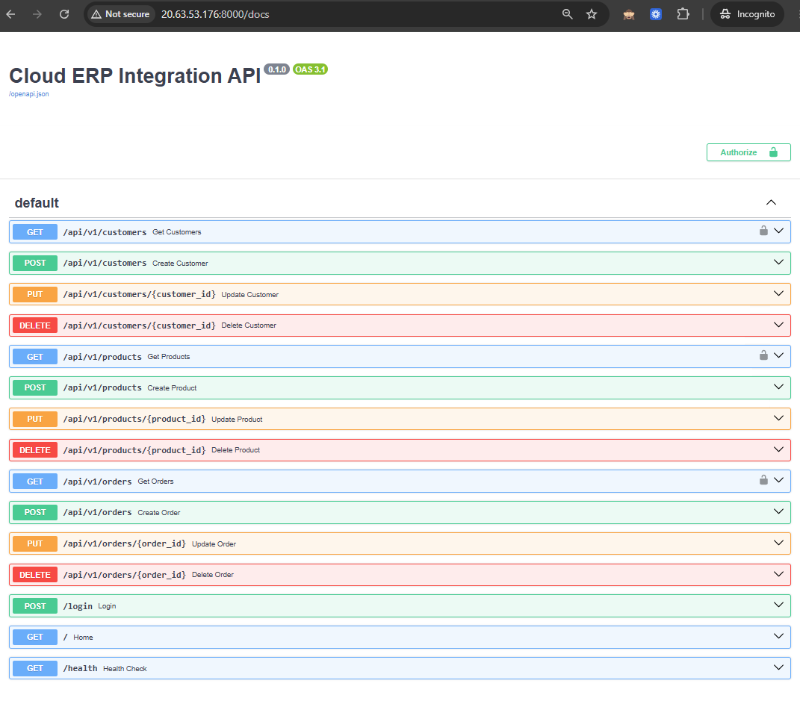
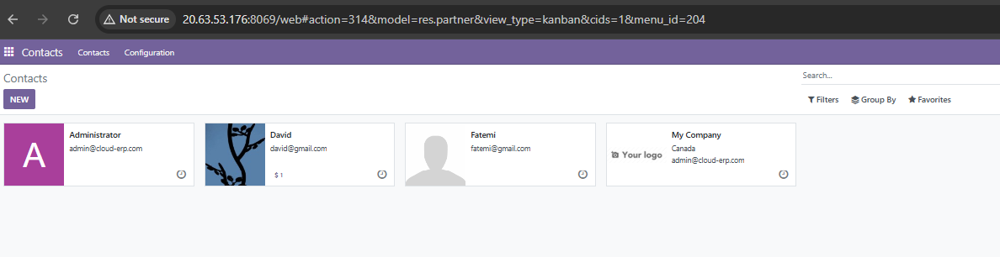
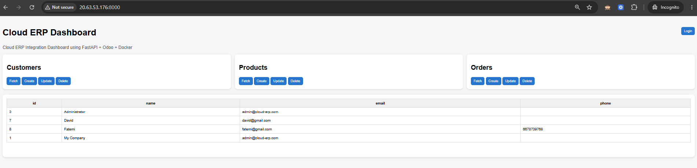
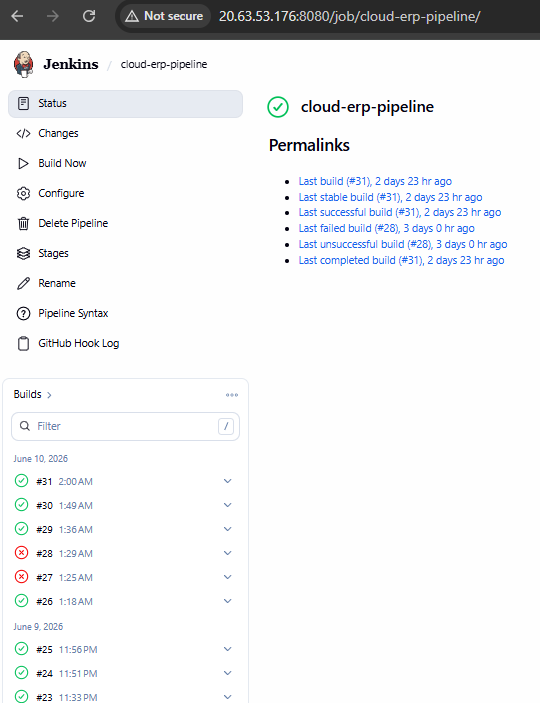

# Cloud Native ERP Integration Platform

A fully containerized FastAPI + Odoo ERP integration platform deployed on Azure VM, featuring:

- Cloud hosted Odoo ERP
- FastAPI REST API layer
- PostgreSQL database
- JWT authentication
- Jenkins CI/CD pipeline
- Docker based deployment
- Centralized logging

This project modernizes an on premise ERP into a cloud native architecture with clean API exposure for Customers, Products, and Orders.

---

## Project Structure

```text
CLOUD_ERP_INTEGRATION/
│
├── fastapi_service/
│   ├── main.py
│   ├── dockerfile
│   ├── requirements.txt
│   ├── .env
│   ├── core/
│   │   ├── config.py
│   │   ├── logger.py
│   │   └── security.py
│   ├── routes/
│   │   ├── customers.py
│   │   ├── products.py
│   │   └── orders.py
│   ├── services/
│   │   └── odoo_client.py
│   ├── templates/
│   │   └── index.html
│   └── static/
│       └── app.js
│
├── images/
│   ├── swagger.png
│   ├── odoo_contacts.png
│   ├── api_dashboard.png
│   └── jenkins_build.png
│
├── docker-compose.yml
├── Jenkinsfile
├── .gitignore
└── README.md
```

---

## Screenshots

### Swagger API UI


### Odoo ERP Contacts


### API Dashboard


### Jenkins Build Pipeline


---

## Features

### Backend

- FastAPI REST API layer
- Clean modular routing
- XML-RPC integration with Odoo
- Centralized logging

### ERP Modules

- Customers CRUD
- Products CRUD
- Orders CRUD

### Security

- JWT authentication
- Token-protected endpoints
- Secure login flow

### DevOps

- Docker containerization
- Azure VM deployment
- Jenkins CI/CD pipeline
- Automated build + deploy

### Logging

- Custom logger
- Request/response tracking
- Error tracing

---

## Authentication

### 1. Login to Generate a JWT Token

```http
POST /login
```

**Response**

```json
{
  "access_token": "<JWT_TOKEN>"
}
```

### 2. Use the Token in Protected Endpoints

```http
Authorization: Bearer <JWT_TOKEN>
```

## Docker Setup

### Start All Services

```bash
docker compose up -d --build
```

### Stop Services

```bash
docker compose down
```

### Containers Included

- fastapi-app
- odoo-app
- odoo-db
- jenkins

## Environment Variables

Your `.env` file should include:

```env
SECRET_KEY=your_jwt_secret
ALGORITHM=HS256
ODOO_URL=http://odoo-app:8069
ODOO_DB=postgres
ODOO_USERNAME=odoo
ODOO_PASSWORD=odoo
```

---

## API Endpoints

### System

- Home page – `GET /`
- Generate JWT token – `POST /login`
- Health check – `GET /health`

---

### Customers

- Fetch all customers – `GET /api/v1/customers`
- Fetch customer by ID – `GET /api/v1/customers/{id}`
- Create customer – `POST /api/v1/customers`
- Update customer – `PUT /api/v1/customers/{id}`
- Delete customer – `DELETE /api/v1/customers/{id}`

---

### Products

- Fetch all products – `GET /api/v1/products`
- Fetch product by ID – `GET /api/v1/products/{id}`
- Create product – `POST /api/v1/products`
- Update product – `PUT /api/v1/products/{id}`
- Delete product – `DELETE /api/v1/products/{id}`

---

### Orders

- Fetch all orders – `GET /api/v1/orders`
- Fetch order by ID – `GET /api/v1/orders/{id}`
- Create order – `POST /api/v1/orders`
- Update order – `PUT /api/v1/orders/{id}`
- Delete order – `DELETE /api/v1/orders/{id}`

---

## CI/CD Pipeline (Jenkins)

### Pipeline Stages

- Pull latest code from GitHub
- Build FastAPI Docker image
- Push image to registry (optional)
- Deploy to Azure VM
- Restart FastAPI container

### Trigger

- GitHub Webhook → Jenkins auto-build

---

## Deployment on Azure VM

### Steps

- Create Azure VM
- Install Docker + Docker Compose
- Clone repository

### Run the application

```bash
docker compose up -d --build
```

### Access Services

- FastAPI  
  http://<vm-ip>:8000/docs

- Odoo  
  http://<vm-ip>:8069

- Jenkins  
  http://<vm-ip>:8080

---

## Logging

Logs are generated via:

```text
core/logger.py
```

### Includes

- Timestamp
- Log level
- Endpoint
- Error messages

---

## Testing

### Use Swagger UI

```text
http://<vm-ip>:8000/docs
```

### Or test with curl

```bash
curl -X GET http://localhost:8000/api/v1/customers
```

---

## Future Enhancements

- Role-based access control
- Unit tests with pytest

---

## Conclusion

This project transforms a legacy ERP into a cloud-native, API-driven, scalable platform with modern DevOps practices and secure authentication.
